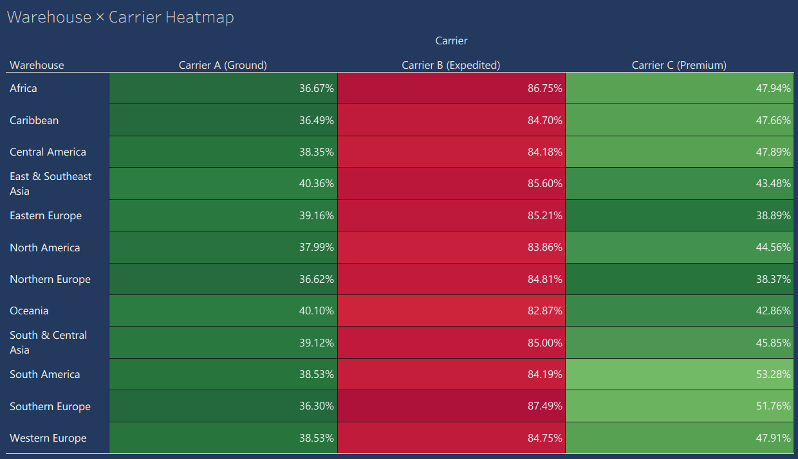
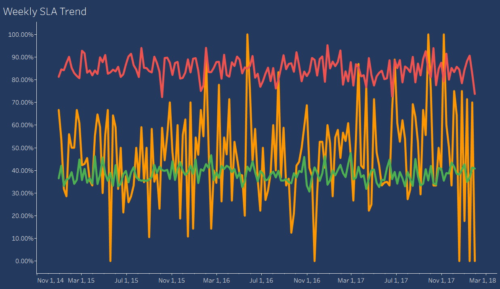

# Supply chain delay root cause analysis
 
Identifying why shipments breach SLA, and proving the cause with data —
built end to end from a public logistics dataset using SQL, Python, and
Tableau.
 
**Stack:** Python (Pandas, statsmodels, seaborn) · SQL (SQLite) · Tableau
 
---
## The question
 
Shipments were breaching SLA at a high rate. Is it a warehouse problem, a
carrier problem, or a symptom of what kind of orders get shipped? The
analysis rules out alternatives one at a time until only one explanation
survives.
 
## Dataset
 
[DataCo Smart Supply Chain for Big Data Analysis](https://www.kaggle.com/datasets/shashwatwork/dataco-smart-supply-chain-for-big-data-analysis)
(Kaggle, public). ~180K order line items; sampled to 50,000 shipment
records for this analysis. `Order Region` was collapsed into 12 warehouse
buckets, `Shipping Mode` into 3 carrier tiers, to match a realistic
network scale.

## Method
 
1. **Clean** — parsed dates, computed `delay_days` and `sla_breach`,
   bucketed 23 raw regions into 12 warehouses and 4 shipping modes into 3
   carriers.
2. **SQL** — aggregated breach rate by warehouse, by carrier, and by
   warehouse × carrier route to find where breaches concentrate.
3. **Correlation analysis** — checked order-level features (discount
   rate, price, quantity, profit ratio) against breach risk, and compared
   those features across carriers, to rule out "harder orders" as a
   confound.
4. **Time-series decomposition (STL)** — split the weekly breach-rate
   series into trend, seasonal, and residual components to check whether
   the problem was worsening, seasonal, or chronic.
5. **Tableau dashboard** — one-page interactive view (KPI cards, carrier
   comparison, warehouse × carrier heatmap, weekly trend) with carrier
   and warehouse filters, built for non-technical stakeholders.
## Key findings
 
- Overall SLA breach rate: **54.9%**
- **Carrier B (Expedited)** breaches SLA at **84.7%**, more than double
  Carrier A (38.3%) and well above Carrier C (46.5%)
- Carrier B's breach rate is **uniform across all 12 warehouses**
  (82.9%–87.5%, a 4.6-point spread) — ruling out a regional/fulfillment
  explanation
- Order characteristics (discount rate, price, quantity, profit ratio)
  are **statistically indistinguishable across carriers** — ruling out
  "Carrier B just gets harder orders" as an explanation
- Despite carrying only ~35% of shipment volume, Carrier B accounts for
  **53.6% of all network SLA breaches**
- STL decomposition shows the problem has been **chronic and stable
  since 2015**, not a recent spike and not self-correcting — no seasonal
  or trend effect explains it away
**Conclusion:** the SLA breach problem is isolated to a single carrier's
performance, not warehouse operations or order mix — pointing directly
at a carrier contract/SLA renegotiation rather than an internal
fulfillment fix.
 
Full write-up with methodology detail: [`docs/findings.md`](docs/findings.md)
 
 ## Dashboard


Interactive Tableau dashboard with click-to-filter: selecting a carrier
or warehouse filters the entire page. Published version:
[link once you publish to Tableau Public]


*Breach rate by warehouse and carrier — Carrier B is red across every
single region, proving the problem is carrier-wide, not regional.*


*Carrier B (red) has sat well above the network average for the entire
3-year period — a chronic issue, not a recent spike.*
```


## Project structure
 
```
supply-chain-delay-analysis/
├── 01_clean_and_explore.ipynb   # full analysis notebook, run top to bottom
├── data/
│   ├── raw/                     # DataCoSupplyChainDataset.csv (download from Kaggle)
│   └── processed/                # cleaned CSV, SQLite DB, saved chart images
├── sql/
│   └── analysis_queries.sql     # the actual SQL queries used, cleaned up for reference
├── docs/
│   └── findings.md              # full findings write-up
└── tableau/                      # .twbx dashboard file
```
 
## Reproducing this
 
1. Download the dataset from the Kaggle link above into `data/raw/`
2. `pip install pandas numpy statsmodels matplotlib seaborn sqlalchemy --break-system-packages`
3. Open `01_clean_and_explore.ipynb` in Jupyter and run all cells top to bottom
4. Open the Tableau dashboard, pointed at `data/processed/shipments.csv`
## Limitations
 
- Public dataset, not live production data — the methodology is real,
  the specific numbers are illustrative of the approach rather than an
  actual company's operations.
- "Estimated delay cost" (if included in the dashboard) uses
  `benefit_per_order` as a rough proxy, not an audited cost model.
 
